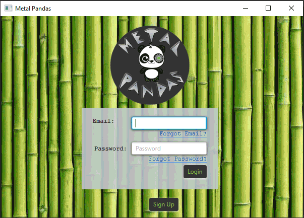
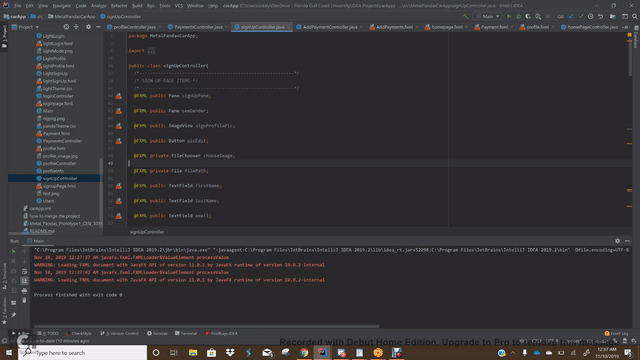

# Metal Pandas Order a Car

Metal Pandas Order a Car will allow users to sign up to get or provide transportation to others. Users will enter data for their 
profile, payment, and area they are providing or using the service. The user will then arrange transportation by adding dates and times, location using google maps, and will provide feedback on how the application could be better.

# Authors
- Kathryn Campo
- Jana Grunewald
- Odalys Martinez-Villa
- Kevin Mak
- Nick Wright
- Owen Rose

## Demonstration
- You can find a video of our Alpha Build below:
Prototype 1 (19 Oct 2019) - https://youtu.be/nQOjyDzGnyU
Prototype 2 (9 Nov 2019) - https://www.youtube.com/watch?v=phqiKVj4hic&t=31s
Deliverable prototype (2 Dec 2019) - https://www.youtube.com/watch?v=MwK8OBSgO2U
Final Prototype (5 Dec 2019) - https://youtu.be/ZnvLbTJzmQ0

https://youtu.be/nQOjyDzGnyU
- Here is a video of our final deliverable: https://youtu.be/MwK8OBSgO2U

## Documentation
JavaDocs in IDE.
SRS Document: https://docs.google.com/document/d/1I0pUnY_4xJUNJSs54udfI6M5wUo0w10nXLBf26q5RLo/edit?usp=sharing

## Getting Started
To get this program started on your computer, follow the steps below:
Download the IDE of your choice capable of creating and running a JavaFX project. This IDE must be able to use databases. Clone this repository, then open the project in your IDE. Establish the database on your computer and direct it with the file path to the res folder you initially cloned. After this the program should run.

## Built With
IntelliJ Idea Ultimate, 
Scene Builder, 
Discord group discussions

## Author
Nicholis Wright, Jana Grunewald, Owen Rose, Kathryn Campo, Odalys Martinez-Villa, Kevin Mak

## Acknowledgments
Stack Overflow, Scenebuilder, IntelliJ

## History
10/7/2019 This project started out as a GUI with no data base attached. 

10/15/2019 The project is linked to a database with tables. The project also now has a layout for future screens.

10/20/2019 The first prototype is complete with full CSS styling, complete with logic to move between pages and a working login method.

11/09/2019 The beta of our prototype has integrated googlemaps API, a rating system for drivers, additional payment pages and increased 
          database functionality.

12/5/2019 The final beta of our prototype was submitted and shown to the class. Overall the program is mostly functional. Users can now update their profile, schedule a ride, create favorites, add a payment method and pay for a ride. The dark and light theme now work with all the scenes properly. User-friendly error messages now pop up whenever a user enters a wrong credential and when a user leaves a field blank.

